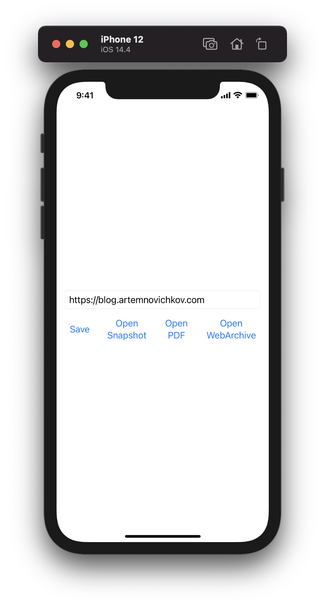
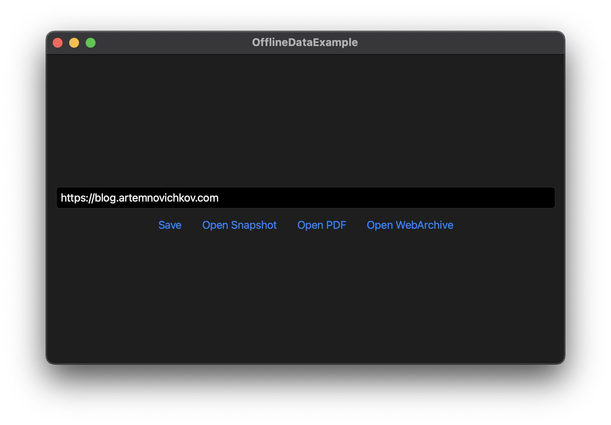

# Offline Data Example

An example project for [Working with web content offline in SwiftUI apps](https://artemnovichkov.com/blog/swiftui-offline) article.

  
  

## Author

Artem Novichkov, mail@artemnovichkov.com

## License

The project is available under the MIT license. See the [LICENSE](./LICENSE) file for more info.
